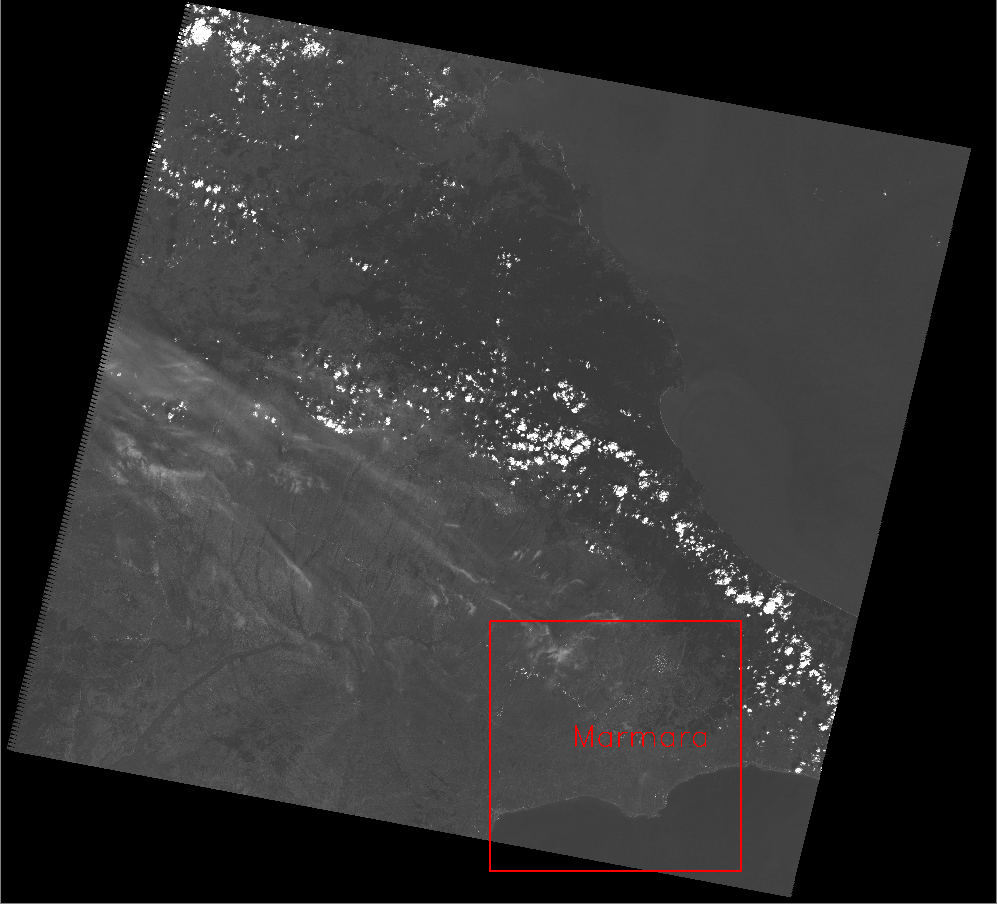
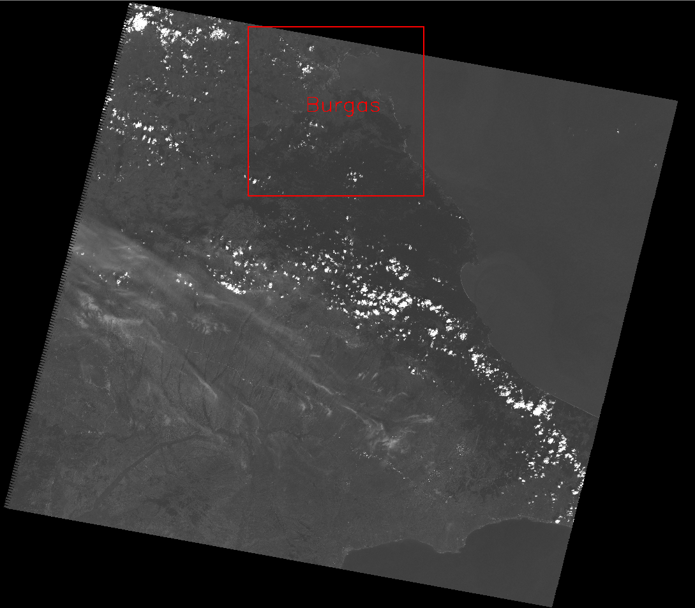

ИСАК. Лабораторная работа №1
=====================

Выполнили ст. гр. м30-312Б: Кильчуков Т., Коновалов А.

### Описание
- Перед запуском программы необходимо разархивировать папку unzip с рабочим снимком.
- Задать в main.py координаты нужного города.
- Исполнить файл main.py

### Примеры работы программы 
Пример №1

Пример №2

