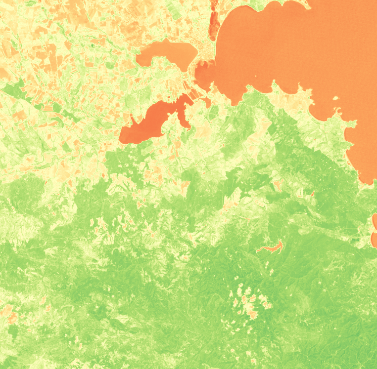

ИСАК. Лабораторная работа №1
=====================

Выполнили ст. гр. м30-312Б: Кильчуков Т., Коновалов А., Стукошин В.
### Задание №1 - Обозначить на снимке город с заданной долготой и широтой
- Opencv
- Задать в main.py координаты нужного города.
- Исполнить файл main.py

Пример работы:

### Задание №2 - Рассчитать NDVI
- NDVI = (Pnir - Pred)/(Pnir + Pred)
- Landsat7: Pred=B3 , Pnir=B4
- Открытие и вывод снимков: Rasterio
- Расчёт формулы: Numpy
- Задать в rast.py имена снимков красного и инфрокрасного цвета, вызвать функцию ndvi_caclucate_landsat7 и передать ей значения

Пример работы:

